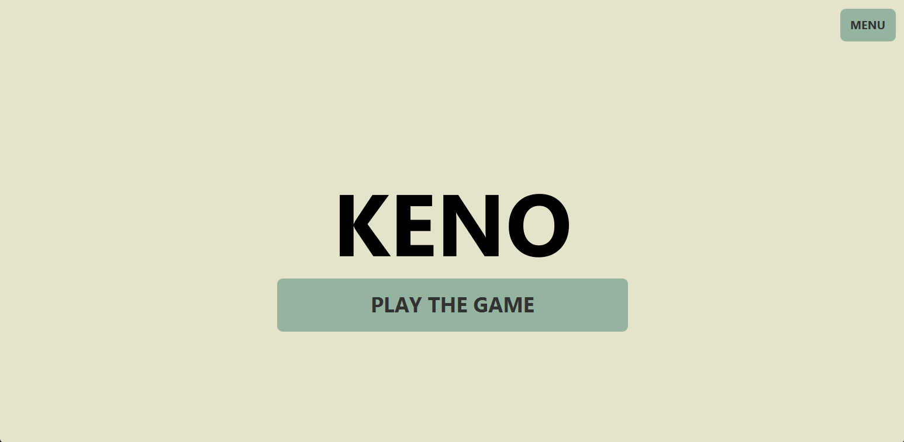
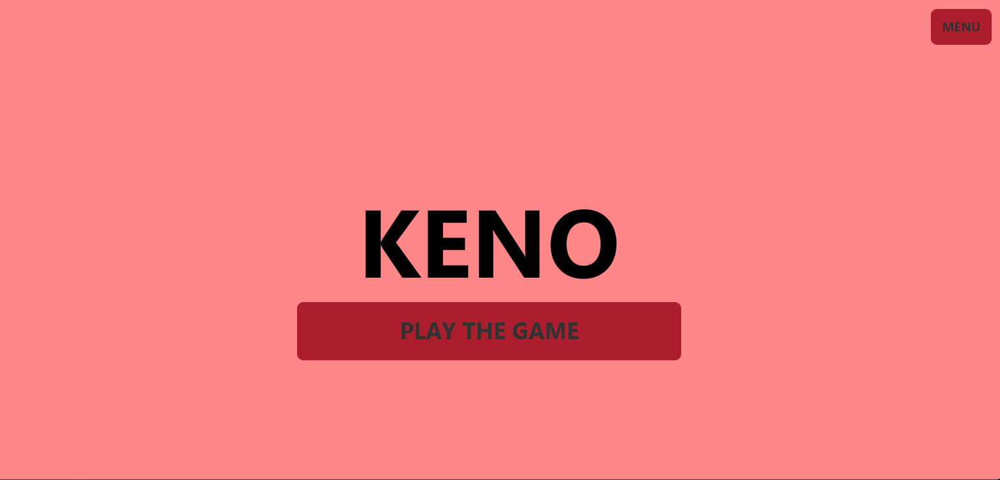
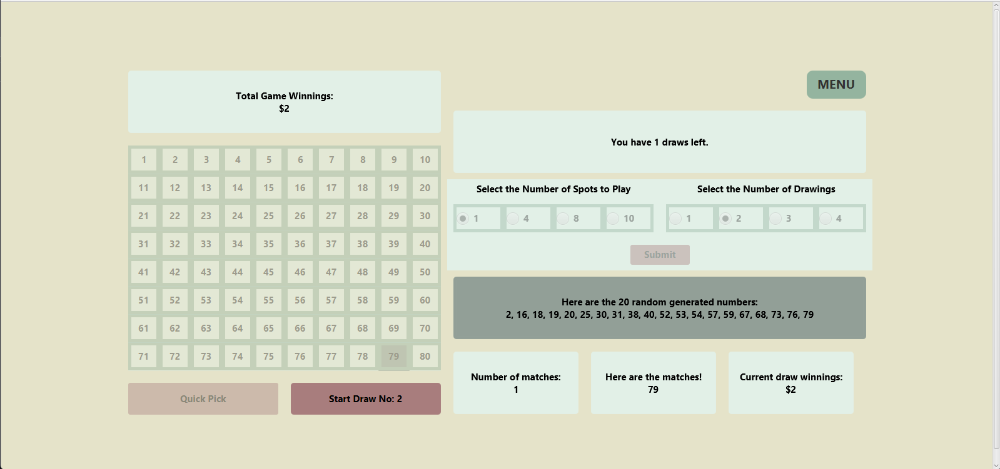
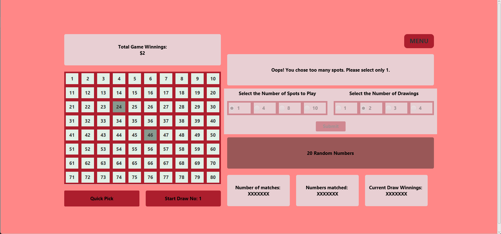
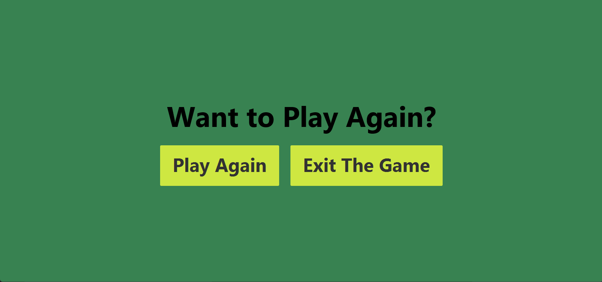
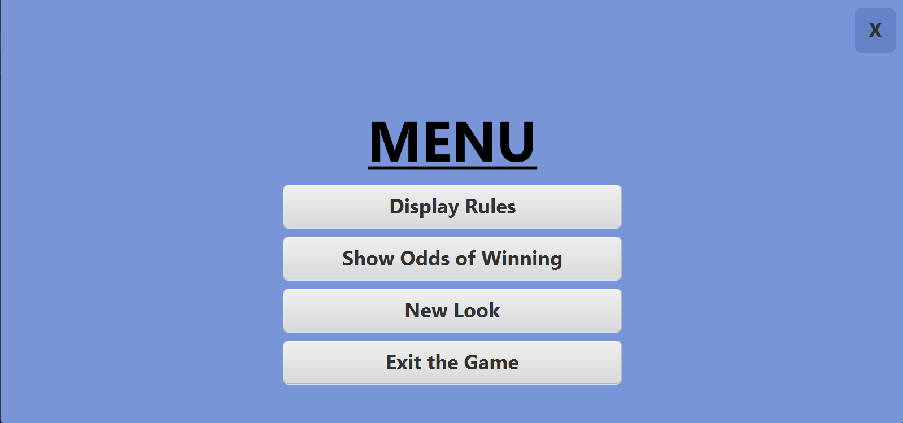
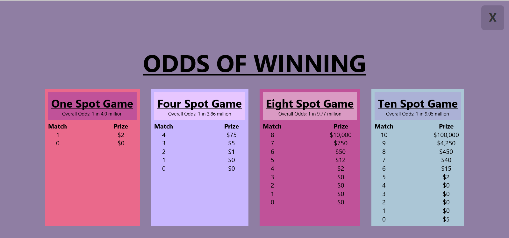
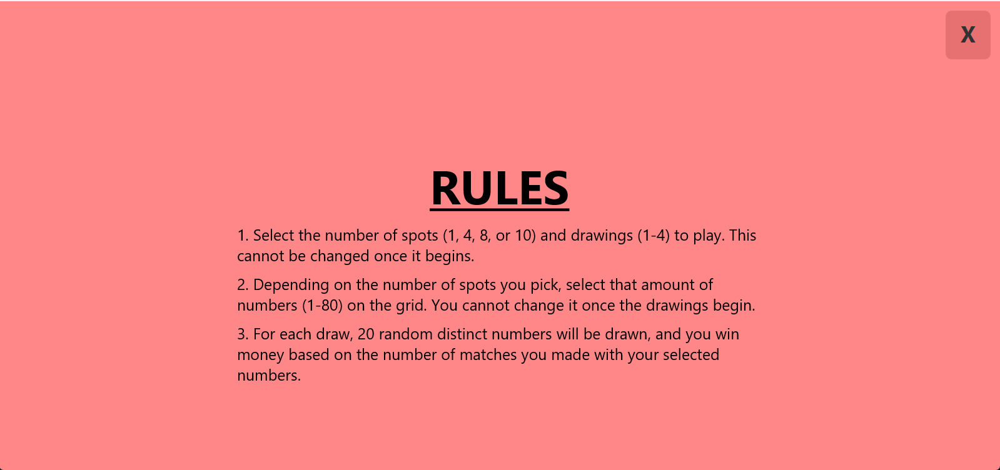

# 🎰💵 Lotto Simulator 🎲🤩

## Overview
Welcome to our Keno game implementation! Keno is a well-known casino and state lottery game that we have developed for single-player enjoyment. By utilizing event-driven programming techniques and harnessing the power of JavaFX, we have created a captivating graphical user interface (GUI) that adds a visually stunning and interactive element to the game. Immerse yourself in an enhanced gaming experience as you explore the world of Keno through our engaging UI.

## Authors
[Flora Huang](https://github.com/fhuan10) & [Nandini Jirobe](https://github.com/nandinijirobe)

## Project Images
Here are some visuals showcasing our project.

  
    

  
  

  
  

  
  

